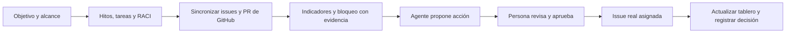

# NERV: gerencia estratégica conectada al trabajo real

> **Alcance histórico, sustituido para esta entrega.** El [MVP vigente de 110 minutos](../mvp/README.md) y sus [contratos](../mvp/CONTRATOS.md) prevalecen sobre funcionalidades, arquitectura, reparto y tiempos de este plan. No sumar sus requisitos al MVP reducido.

**Versión:** propuesta ejecutable con recursos del evento. **Equipo:** tres personas y sus agentes de programación. **Tiempo:** 300 minutos obligatorios; hasta 60 adicionales si el plazo oficial lo permite. Consultar [RECURSOS-Y-ARRANQUE.md](RECURSOS-Y-ARRANQUE.md) para herramientas, enlaces y primeras instrucciones de cada miembro.

## 1. Definición del proyecto

NERV es un **espacio de trabajo compartido para planear, conversar, ejecutar y dirigir proyectos**. Reúne Project Charter, objetivos, Kanban, reuniones, diagramas conceptuales, RACI, indicadores y riesgos, conectados con la ejecución observable en GitHub. Sus agentes especialistas ayudan en planeación, coordinación y control; revisan contexto, explican desvíos y preparan propuestas. Una persona decide qué cambios y compromisos aceptar.

El problema que aborda es la separación entre lo que un equipo quiere lograr, lo que sus integrantes están construyendo y las decisiones que necesita tomar cuando aparece un bloqueo. El usuario inicial es quien dirige un equipo pequeño de software o analítica que ya trabaja con GitHub y asistentes de programación.

**Objetivo general:** permitir que ese equipo establezca un plan, distribuya responsabilidades y cierre un ciclo de seguimiento y decisión sin perder la relación con el resultado esperado.

**Objetivos específicos del prototipo:**

- Registrar propósito, objetivo medible, alcance, restricciones y criterios de éxito.
- Permitir que tres miembros autenticados conversen y modifiquen el mismo proyecto desde sesiones diferentes.
- Descomponer la ejecución en hitos y tareas con fechas y responsables.
- Interactuar con un Kanban, organizar reuniones y consultar un mapa conceptual del proyecto.
- Distinguir quién ejecuta, quién responde por el resultado y quién debe ser consultado o informado.
- Contrastar el plan con issues y pull requests reales y un indicador de resultado registrado por una persona.
- Proponer y ejecutar, previa aprobación, una acción correctiva trazable.

La visión posterior abarca múltiples proyectos, portafolios, recursos y otras integraciones. La primera versión administra **un proyecto compartido, tres miembros y un repositorio seleccionado**, con interfaz en inglés y español. El nombre NERV se toma del repositorio de trabajo; no se inventa una expansión obligatoria de la sigla.

## 2. Experiencia que debe funcionar completa

**Ejemplo de demostración:** un equipo distribuido busca validar un flujo de registro con cinco usuarios de prueba. Registra su Charter, dos hitos y responsables; un miembro escribe en la conversación y otro mueve una tarjeta del Kanban. Organizan una reunión con agenda y ven la hora en sus zonas. Una issue del primer hito aparece bloqueada; el KPI está en 2 de 5 usuarios, con fecha y fuente manual. El especialista en riesgos relaciona el bloqueo con el hito, explica el posible impacto y propone una tarea de mitigación. El líder revisa el texto y el destinatario, aprueba y abre la issue creada en GitHub. El mapa conceptual permite ver qué objetivo y entregable afecta.

El bloqueo, los participantes y la medición son datos de un **caso de prueba identificado como tal**; las lecturas y la creación en GitHub sí deben ser reales. Crear la issue no elimina el riesgo ni acredita el logro del objetivo: el seguimiento continúa hasta tener evidencia de resolución.

**Por qué importa el entorno:** la recomendación depende del estado, fechas, responsables y enlaces reales del repositorio; la acción vuelve al lugar donde el equipo ejecuta el trabajo. Una captura, una respuesta de chat o un tablero con cifras inventadas no completa este ciclo.

## 3. Alcance obligatorio y límites

| Módulo | Lo que se entrega en cinco horas | Prueba observable |
|---|---|---|
| Project Charter | Acta editable: propósito, sponsor, líder, objetivo, alcance incluido/excluido, entregables, restricciones, supuestos y criterios de éxito; estado borrador/aprobado | Guardar, recargar y registrar aprobación del líder; editar devuelve a borrador |
| Kanban y plan | Tres columnas To do / In progress / Done; tarjetas con hito, responsable, fecha y criterio de aceptación; cambio de columna con selector o botones | Dos miembros ven la misma tarjeta actualizada; arrastrar es opcional |
| Conversación | Un canal de texto por proyecto, con autor y hora; mensajes humanos persistidos | Un segundo usuario ve el mensaje sin recarga manual; consulta cada cinco segundos, más latencia de red |
| Reuniones | Crear reunión con título, agenda, asistentes, inicio, duración y enlace opcional; registrar acuerdos | Ver el mismo instante en Bogotá, Singapur y Los Ángeles; sin invitaciones externas automáticas |
| Mapa conceptual | Diagrama de objetivo → hitos → tareas, derivado de los datos; seleccionar un nodo abre su detalle | Editar un hito y ver su cambio en el mapa; no es una imagen fija |
| Equipo y RACI | Tres miembros configurables; un A y al menos un R por hito; C e I opcionales; un responsable humano por tarea | Rechazar un hito sin A/R y una tarea con miembro inexistente |
| Seguimiento GitHub | Importar issues abiertas/cerradas y contexto básico de PR; vincular issues al plan; mostrar fuente y hora de consulta | Ver un cambio real tras pulsar Sincronizar |
| Indicadores | Avance de entrega, tareas vencidas y bloqueos; un KPI de resultado con categoría, unidad, meta, valor, fecha, fuente y dueño | Ninguna división por cero; desconocido se muestra como sin datos |
| Riesgos y decisiones | Riesgo con categoría, probabilidad/impacto cualitativos, responsable, mitigación y estado; bitácora de cambios importantes | Consultar evidencia y decisión tomada |
| Especialistas | Planeación, coordinación y riesgos/control: tres perfiles con instrucciones y herramientas delimitadas, sobre un motor común y bajo demanda | Cada perfil devuelve una revisión contextual trazada; riesgos puede proponer una issue válida |
| Aprobación y acción | Revisar, editar, rechazar o aprobar la propuesta; crear issue una vez, comprobar asignación y actualizar el tablero | Rechazar no escribe; doble clic no duplica; resultado enlaza a GitHub |

Una única sala de proyecto tiene navegación hacia **Overview / Charter**, **Board / Team**, **Meetings** y **Insights / Map**, y un panel persistente de conversación y especialistas. Los módulos comparten las mismas entidades: no construir aplicaciones independientes para cada pestaña. Kanban interactivo es obligatorio; arrastrar tarjetas se sustituye por un selector accesible si falta tiempo.

**La entrega es una plataforma interactiva:** seleccionar un nodo abre su registro; editar RACI o Charter guarda cambios; mover una tarjeta actualiza el proyecto; una alerta abre sus evidencias; una reunión se puede modificar y consultar en otras zonas. CopilotKit conecta el asistente con la vista y selección actuales y renderiza resultados como tarjetas accionables. El chat entre personas permanece separado del asistente. Ninguna pieza se entrega como una diapositiva, imagen fija o formulario que descarta los cambios.

El primer plan se crea con un formulario y una plantilla editable. El especialista de planeación revisa su coherencia; el de coordinación revisa responsables/bloqueos y sugiere una agenda; el de riesgos interpreta indicadores y puede proponer la acción GitHub. Las revisiones se guardan en NERV. Generación completa de planes, edición automática del Charter y convocatorias externas son mejoras posteriores.

**Fuera de la entrega inicial:** varias organizaciones, registro abierto, autenticación empresarial, videollamadas, mensajes privados, calendarios externos, editor libre de diagramas, traducción automática del chat, GitHub Projects API, Slack/Teams, ejecución autónoma de código, revisión o merge de PR por el agente, publicación de comentarios externos, voz, procesamiento de los PDF dentro de la app, buscador externo, RAG, facturación, Gantt avanzado, cálculo CPM, EVM/SPI/CPI y una plataforma MLOps.

La demo usa tres cuentas reales autenticadas con Auth0, datos compartidos en Postgres alojado en Supabase y una URL común si el despliegue está listo. Si el hosting se demora, las tres máquinas pueden ejecutar la app contra la misma base, con callbacks Auth0 configurados para sus entornos locales; deben demostrar colaboración entre sesiones reales. No confundir perfiles visuales con identidad autenticada. El líder aprueba Charter y acciones GitHub; todos los miembros pueden conversar, gestionar tareas y organizar reuniones.

**Uso internacional:** inglés por defecto, selector español/inglés y textos de interfaz en diccionarios. Contenido del usuario se conserva en su idioma; el agente responde en el idioma elegido. Guardar instantes en UTC y zona IANA de reuniones; mostrar fecha completa y zona, sin formatos ambiguos. Usar `America/Bogota`, `Asia/Singapore` y `America/Los_Angeles` como casos de prueba; no codificar desfases fijos. El producto usa términos de gestión reconocibles y no depende de referencias a una asignatura o país.

## 4. Marco teórico convertido en comportamiento

El producto sigue el ciclo **planificar → organizar → dirigir → controlar → ajustar** de las diapositivas. La ficha y el desglose por entregables cubren planificación; RACI cubre organización; decisiones y eliminación de bloqueos cubren dirección; indicadores y evidencia cubren control; una acción aprobada cierra el ajuste.

DIKW inspira la transformación de registros en información contextualizada y recomendaciones. Una interpretación de un LLM no constituye por sí sola conocimiento validado. La gobernanza se concreta en campos con origen, fecha, validaciones e historial. La incertidumbre se expresa como supuestos y riesgos, sin presentar una fecha estimada como certeza.

El cuadro de mando separa métricas de **resultado** y de **ejecución**. Cerrar tareas no demuestra que aumentaron las ventas, mejoró la calidad o se validó una hipótesis. Los marcos analíticos de las diapositivas pueden convertirse después en plantillas de proyectos; no obligan a construir sus plataformas completas dentro de NERV.

Consultar [TRAZABILIDAD.md](TRAZABILIDAD.md) para conceptos, páginas y tratamiento de cada referencia. Misión/visión formal, DOFA y OKR pueden agregarse como decisiones de producto posteriores; no se presentan como contenido explícito de estos PDF.

## 5. Herramientas y arquitectura elegidas

Un único repositorio NERV y una aplicación web principal, con módulos separados por responsabilidad. Usar `apps/web` del [Starter Kit oficial](https://github.com/CopilotKit/agents-everywhere-starter-kit); conservar su estructura de workspace y versiones compatibles, sin levantar las otras aplicaciones del kit. P2 fija el commit de referencia y preserva los documentos existentes y el remoto del equipo.

| Uso | Elección | Razón y condición |
|---|---|---|
| Base y aplicación | Starter Kit, `apps/web`, Next.js/React/TypeScript | Adaptar la aplicación web del evento a NERV; mantener contratos UI/backend. [Template web](https://github.com/CopilotKit/agents-everywhere-starter-kit/blob/main/apps/web/README.md) |
| Entorno | Node.js compatible con el commit del kit; preferir 24 LTS si cumple sus requisitos; npm/lockfile del workspace | Congelar la versión exacta comprobada en H0 y respetar engines/.nvmrc. [Versiones oficiales de Node](https://nodejs.org/en/about/previous-releases) |
| Identidad | Auth0 Universal Login y `@auth0/nextjs-auth0`; tres cuentas de prueba | P2 verifica sesión y permisos NERV. El ejemplo M2M del kit no sustituye este login humano. [Auth0 Next.js](https://auth0.com/docs/quickstart/webapp/nextjs) |
| Datos compartidos | Postgres alojado en Supabase, consultado solo desde servidor | Almacena Charter/RACI, tareas, mensajes y aprobaciones; sin un segundo login Supabase. RLS deniega acceso directo de cliente. [RLS](https://supabase.com/docs/guides/database/postgres/row-level-security) |
| Asistente en la interfaz | CopilotKit React y runtime del starter | P1 contexto/acciones visuales; P3 herramientas servidor. Reutilizar las APIs de la versión fijada. [Quickstart](https://docs.copilotkit.ai/quickstart) |
| Colaboración | Consulta periódica cada cinco segundos mientras la sala esté activa; mensajes y cambios persistidos | Evita añadir un servidor de sockets. Mostrar estado de guardado y conflictos |
| Contratos | Zod y tipos TypeScript compartidos | Validar entradas HTTP, datos externos y propuestas del agente. [Zod](https://zod.dev/) |
| GitHub | REST desde servidor con `fetch`; token de alcance limitado al repositorio | Leer issues/PR y crear una issue asignada. [Issues](https://docs.github.com/en/rest/issues/issues), [PR](https://docs.github.com/en/rest/pulls/pulls) |
| Especialistas | OpenAI Agents SDK TypeScript, `@openai/agents`; un modelo habilitado por la cuenta | P3 configura Agent/tool/run y salida validada. El SDK se invoca mediante una función servidor NERV, no mediante un adaptador AG-UI supuesto. [Quickstart SDK](https://openai.github.io/openai-agents-js/guides/quickstart/) |
| Construcción | Claude Code o Codex, según disponibilidad de cada integrante | Cada humano coordina su frente; no se impone una marca a una capa del sistema |
| Colaboración | GitHub Issues para tareas, PR para revisión, ramas y worktrees/clones aislados | Permite paralelismo sin compartir archivos en edición. [Git worktree](https://git-scm.com/docs/git-worktree) |
| Verificación | Vitest para reglas y contratos; Playwright para un recorrido completo | Probar los riesgos que afectarían la demo. [Vitest](https://vitest.dev/guide/), [Playwright](https://playwright.dev/docs/intro) |
| Diagrama e idiomas | SVG/HTML derivado de entidades, dos diccionarios y `Intl.DateTimeFormat` | Nodos seleccionables, alternativa textual accesible y horarios localizados. [Fechas y zonas](https://developer.mozilla.org/en-US/docs/Web/JavaScript/Reference/Global_Objects/Intl/DateTimeFormat) |
| URL compartida | Vercel para el monolito, si la cuenta del equipo está disponible | Desplegar pronto y probar sesión/API; la base permanece en Supabase. [Next.js en Vercel](https://vercel.com/docs/frameworks/full-stack/nextjs) |
| Presentación | Grabación de pantalla y editor ya disponible para el equipo | Video máximo de dos minutos; no aprender una plataforma nueva durante el cierre |

P2 incorpora y fija dependencias sobre el lockfile del starter; los otros frentes solicitan cambios mediante una tarea concreta. Auth0 aporta la sesión; `session.user.sub` se mapea a `Member.authSubject`, un texto que no se fuerza a UUID. Todas las lecturas/escrituras pasan por rutas que validan usuario y proyecto antes de utilizar la conexión administrativa de Postgres. El navegador no recibe claves de base de datos ni necesita federación Auth0–Supabase para este MVP.

P3 implementa `reviewProject()` una sola vez: lo llama una herramienta servidor de CopilotKit o el botón directo vía `/api/agent/review`. P3 posee `ReviewCard` y `ProposalCard` en `features/intelligence`; P1 las importa en el shell y en los renderizadores CopilotKit. La conversación y el SDK son dos capas explícitas; no sincronizan automáticamente sus estados. Hay ensayo en H0 y prueba integrada hasta T75; después se adopta el botón directo si la unión falla. [Herramientas servidor CopilotKit](https://docs.copilotkit.ai/server-tools).

**Otros recursos del paquete:** Exa es investigación externa acotada para P3; Ambiguous AI es una extensión de registros/documentos para P2; OpenRouter es alternativa de proveedor verificada por P3; Voice/Channels/Mozilla.ai son ampliaciones. Tienen tareas y condiciones de activación en [RECURSOS-Y-ARRANQUE.md](RECURSOS-Y-ARRANQUE.md). El núcleo no depende de que todas las cuentas de sponsors estén activadas.

**Plan de contingencia:** si el hosting se demora, conservar Postgres/Auth0 y ejecutar localmente la app con callbacks válidos para demostrar datos compartidos. Si el puente CopilotKit–especialistas falla, los botones directos usan el mismo motor y aprobación mientras CopilotKit conserva contexto/navegación. Sin base/autenticación compartida, usar dobles para desarrollo y declarar la colaboración incompleta. No añadir otra plataforma durante el cierre.

**Credenciales:** P3 humano configura GitHub y el proveedor de modelo. Mantener `MODEL_PROVIDER`, `MODEL` y variables que el commit del kit requiera; P3 adapta esa configuración al cliente Agents SDK explícitamente. P2 humano configura Auth0 (aplicación web, tres usuarios, callbacks/logout/orígenes), secreto de sesión y base de datos solo en servidor. Los valores se documentan sin claves reales en `.env.example`; no registrar secretos en logs, video o commits. El equipo verifica permisos y créditos mediante llamadas mínimas, sin asumir acceso por la lista de sponsors.

## 6. Distribución de personas y agentes

En las rutas siguientes, `src/` se refiere a **`apps/web/src/`**. Las migraciones y configuración compartida viven en la raíz NERV según el contrato; todos los frentes preservan el workspace del starter.

| Frente | Humano responsable | Agentes construyen | Entrega y propiedad |
|---|---|---|---|
| P1: espacio colaborativo y producto | Decide prioridades, valida experiencia e idiomas, graba la demo y prepara la entrega | Sala, Kanban/chat/reuniones, CopilotKit React, contexto y herramientas UI | `src/features/workspace/`; API `tasks`, `messages`, `meetings`; shell `src/app/(workspace)/`; `src/i18n/`; componentes UI del starter |
| P2: estrategia, plataforma e integración | Congela contratos, revisa reglas/permisos, integra y configura datos compartidos/hosting | Starter, Auth0, Postgres, Charter/RACI/KPI/riesgos manuales; Ambiguous opcional | `src/features/strategy/`; `src/server/platform/`; `src/contracts/`; `supabase/`; API `projects`, `members`, `session`; configuración raíz |
| P3: especialistas, control y GitHub | Obtiene accesos, valida diagnósticos y acciones reales, controla APIs y limitaciones | Agents SDK, runtime CopilotKit, GitHub, control/mapa/propuestas; Exa opcional | `src/features/intelligence/`; `src/server/github/`; API `copilotkit`, `github`, `agent`, `proposals`, `insights`; adaptador de modelo del starter y pruebas |

**Cadena de mando de desarrollo:** cada humano tiene un agente coordinador. Ese agente puede delegar tareas acotadas a un implementador y un revisor; un único escritor por conjunto de archivos. Un revisor trabaja en lectura hasta recibir un encargo de corrección con propiedad explícita. Claude Code y Codex pueden alternarse o revisar mutuamente; no deben editar simultáneamente el mismo checkout.

**Diferencia clave:** esos agentes de programación construyen NERV. Los especialistas de NERV son componentes del producto con instrucciones, contexto y herramientas por área, ejecutados bajo demanda sobre un motor compartido. No son tres procesos autónomos permanentes ni tienen acceso a los agentes programadores o al shell. El ejecutor de una acción aprobada está separado de las herramientas del modelo.

Los humanos conservan la decisión sobre objetivo, alcance, compromisos de personas, credenciales, gastos, aceptación, acciones GitHub y publicación. Los agentes elaboran código, pruebas, diagnósticos, borradores y documentación. Las sugerencias de asignación no sustituyen la aceptación del responsable humano.

**RACI de la construcción:** A responde por el resultado, R ejecuta, C es consultado e I es informado. Los agentes ejecutan bajo su responsable humano; nunca ocupan el lugar de A.

| Actividad | P1 | P2 | P3 |
|---|---|---|---|
| Alcance, experiencia y prioridades | A/R | C | C |
| Chat, Kanban, reuniones e idiomas | A/R | C | I |
| Charter, RACI, datos, identidad y contratos | C | A/R | C |
| Especialistas, control, mapa y GitHub | C | C | A/R |
| Integración y calidad técnica | C | A/R | R |
| Aceptación del recorrido | A | R | R |
| Video, publicación y envío | A/R | C | C |

## 7. Hitos y trabajo simultáneo

Los tiempos son minutos desde **T0, inicio oficial de construcción**. P1 anota la hora límite exacta y ajusta hacia atrás el cierre si la ventana real es menor. Los PDF llamados “Semana 1” y “Semana 2-3” son fuentes, no la duración de este plan.

Es una estimación exigente para un prototipo: supone experiencia con el stack, cuentas disponibles y uso de componentes reutilizables permitidos. Si H0 revela un bloqueo de acceso, se consume margen de construcción; no se promete una plataforma de producción en cinco horas.

| Hito / intervalo | P1: producto/UI | P2: dominio/integración | P3: agente/GitHub | Condición de salida |
|---|---|---|---|---|
| H0 · 0–20 | Shell del starter, provider/contexto CopilotKit y diccionarios | Incorporar starter, contratos/fixture, commit; Auth0, Postgres y tres miembros | Lectura GitHub; Agent SDK mínimo; contrato reviewProject y ensayo de unión CopilotKit | Base fijada, servicios responden; frentes trabajan separados |
| H1 · 20–75 | Kanban/chat/reuniones; contexto y herramientas UI CopilotKit | Acceso Auth0/DB, Charter/objetivos/hitos/RACI y pantallas; despliegue | GitHub, puente servidor CopilotKit–Agents SDK, control/mapa y paneles | Dos sesiones comparten cambios; Charter persistido; revisión SDK y lectura GitHub reales |
| H2 · 75–145 | Completar reuniones/zonas, estados de guardado y conflictos; inglés/español | Integrar pantallas estratégicas, permisos y KPI manual; revisar PR de frentes | Tres perfiles consultan contexto; diagnóstico, propuesta persistida y pantalla de aprobación | Sala completa y al menos una revisión por especialista; propuesta con evidencia real |
| H3 · 145–205 | Ensayo entre miembros: conversar, mover tarjeta, registrar reunión | Integración completa, pruebas de acceso y concurrencia; revisar ejecutor de P3 | Aprobar→crear issue→comprobar asignación→actualizar; trazabilidad y deduplicación | Colaboración real + ciclo agente completo + Charter/RACI/mapa consultables |
| H4 · 205–240 | Prueba de uso/idiomas/zonas; guion final | Build, pruebas críticas, instalación limpia, secretos y README | Fallos de APIs, evidencia incompleta, inyección en issue y resultado incierto | Versión candidata estable; no abrir nuevas funciones |
| H5 · 240–290 | Grabar/recortar video; revisar descripción y publicar/enviar desde cuentas humanas | Congelar versión, probar instrucciones y acceso al repositorio público | Revisar video contra funcionalidad real, atribuciones y enlaces; ayudar a subir | Entrega completa enviada y comprobante guardado por el equipo |
| Reserva · 290–300 | Verificar portal | Resolver solo bloqueo de entrega | Verificar enlaces | Margen para errores de carga o conectividad |

**Si existen seis horas:** conservar una entrega mínima lista a T290. Usar T300–340 para mejorar presentación, arrastrar tarjetas o pulir especialistas; T340–360 para comprobar o actualizar la entrega si el portal lo permite. No abrir otra integración ni una arquitectura nueva durante esa hora.

**Ruta crítica de construcción:** servicios y contrato → identidad/persistencia compartida + adaptador GitHub → sala colaborativa + revisiones especializadas → ejecución aprobada → recorrido integrado → video/envío. Es la secuencia de dependencias, no un cálculo CPM formal. P1 y P3 avanzan con el fixture tipado mientras P2 completa plataforma; cada frente implementa sus repositorios y rutas para no concentrar todo el backend en P2.

**Puntos de recorte:**

- A T75, si hay atraso, usar un proyecto precargado **editable** y quitar el flujo de crear otros; mostrar los últimos 50 mensajes sin controles de historial; posponer estimaciones de tareas e histórico KPI; reunión solo con título, agenda, asistentes, hora y duración. Mantener chat persistido, Kanban con selector, mapa derivado, Charter/RACI y tres especialistas con una respuesta cada uno. P2 registra el recorte y ajusta el contrato para que todos implementen lo mismo.
- A T145, si no aparece una propuesta, P3 reduce a un único riesgo, una única acción y un panel sencillo. No sustituir la integración real por un resultado simulado presentado como real.
- A T205, si falta el ciclo completo, todos corrigen ese recorrido; cancelar mejoras y usar la alternativa local contra Supabase si el hosting falla. No eliminar permisos para lograr una URL.
- Sin Auth0, Postgres, GitHub o modelo funcionales, los dobles permiten seguir desarrollando, pero el MVP aún no está completo. El humano resuelve acceso o el equipo declara la limitación; no se rebaja silenciosamente la prueba.

## 8. Acuerdo para compartir repositorio

P2 entrega el commit de base mínima a T5 para abrir ramas; a T20 entrega contratos/fixture y configuración acordados. Si la base aún no está disponible, P1/P3 revisan ejemplos y preparan contratos sin editar el checkout de P2. En equipos distintos, cada persona usa su clon; en una misma máquina, un worktree por escritor. Ramas: `codex/p1-ui`, `codex/p2-domain`, `codex/p3-agent-github`.

Solo P2 modifica `package.json`, lockfile, configuración, migraciones y contratos comunes; solicita a los demás revisión si cambia una interfaz. P1 y P3 informan qué necesitan y continúan con un doble compatible mientras se incorpora. Si un contrato cambia, P2 actualiza esquema/fixture y coordina con el propietario de cada consumidor su adaptación antes de integrar; no entra a editar simultáneamente sus archivos.

Cada tarea de construcción indica: ID, responsable humano, agente escritor, objetivo, archivos permitidos, dependencia, criterio de aceptación y evidencia esperada. Cada PR declara esos mismos puntos y las pruebas ejecutadas. Una PR pequeña se puede revisar antes del hito final; no reservar la primera integración para H3.

P2 revisa los cambios de P1 y P3; P3 revisa dominio y contratos de P2; P1 revisa el comportamiento integrado. P2 fusiona después de esa revisión y de las comprobaciones pertinentes. Cada agente actualiza su rama tras una integración; no revierte cambios ajenos ni resuelve conflictos sobrescribiendo una carpeta completa.

Cada clon/worktree tiene sus variables locales. La base remota es compartida: no ejecutar resets destructivos ni borrar las pruebas de otro frente. Usar un proyecto/identificador de prueba por frente y otro para la demo, todos creados por la semilla de P2. No versionar secretos ni temporales. P2 ejecuta migraciones y coordina cambios de esquema.

Hacer un punto de coordinación de tres minutos cada 45 minutos: **qué funciona, qué bloquea y qué contrato cambió**. P2 mantiene la lista de integración; P1 decide los recortes de alcance. No delegar coordinación en una conversación invisible entre agentes.

## 9. Criterios de aceptación y verificación

La entrega solo se considera completa si los miembros pueden conversar y editar el mismo proyecto, mover tarjetas, organizar una reunión con hora inequívoca y consultar Charter, RACI y mapa; además, invocar los tres especialistas, sincronizar GitHub y aprobar una issue real con asignación comprobada. Deben conservarse los enlaces entre objetivo, hito, tarea, fuente y decisión.

Pruebas mínimas con resultado esperado:

1. **Persistencia y RACI:** el proyecto sobrevive al reinicio; un hito sin A/R o un responsable desconocido se rechaza. Dos sesiones ven mensajes y cambios; una sesión ajena no lee el proyecto ni puede mutarlo.
2. **Indicadores:** cero tareas produce “sin datos”; una tarea vencida abierta cuenta como vencida; cerrar una issue sin completarla no prueba entrega; un PR no duplica el conteo de issues.
3. **Propuesta:** un miembro o evidencia inventados se rechazan; un texto malicioso dentro de una issue no modifica las herramientas ni autoriza acciones.
4. **Control humano:** rechazar no crea una issue; editar invalida la aprobación previa; doble clic y recarga no producen una segunda creación.
5. **Errores externos:** 403/429, timeout y creación con resultado incierto quedan visibles; se conserva el contexto anterior con fecha y se impide el reintento ciego de escritura.
6. **Recorrido final:** después de aprobar, abrir la URL real, comprobar título/responsable, sincronizar y recargar. Confirmar que el riesgo no se marcó resuelto automáticamente.
7. **Colaboración e idiomas:** dos ediciones de la misma versión producen un conflicto visible; una reunión conserva su instante al cambiar idioma/zona; el mapa refleja datos editados. Verificar interfaz inglesa y española sin afirmar traducción del contenido del equipo.

Vitest cubre reglas y adaptadores; Playwright cubre un recorrido local con dobles para repetibilidad. P3 y P1 realizan además un ensayo manual con servicios reales en el repositorio de demo. Pasar pruebas con dobles no sustituye esa comprobación. P2 ejecuta tipos, pruebas y build sobre la versión que se va a entregar.

## 10. Demostración y envío

Guion de **120 segundos**:

| Tiempo | Mostrar |
|---|---|
| 0–15 s | Problema y Charter del equipo distribuido; objetivo y responsables |
| 15–40 s | Dos miembros: mensaje compartido y movimiento Kanban; reunión con zonas y mapa/RACI |
| 40–60 s | Tres especialistas visibles; sincronizar y abrir evidencia GitHub del bloqueo |
| 60–85 s | Especialista de riesgos explica impacto y presenta propuesta; KPI separado del avance |
| 85–110 s | Líder aprueba; abrir issue real y comprobar asignación |
| 110–120 s | Sala actualizada, decisión registrada y alcance del prototipo |

P1 prepara el título y la descripción final usando únicamente funcionalidades comprobadas. P2 deja el repositorio con instalación, configuración de variables sin secretos, semilla de demo, pruebas, arquitectura breve y límites. P3 prepara el registro de componentes reutilizados y de funcionalidad creada durante el evento.

Según el **handbook entregado por el usuario**, se requiere título, descripción, repositorio GitHub público, video de dos minutos y publicación social etiquetando los partners del evento. P1 humano comprueba nombres, etiquetas, portal y hora límite; el texto no proporciona sus valores concretos. La publicación social y el envío los realiza una persona desde sus cuentas, con borradores que los agentes pueden preparar.

El texto exige una construcción nueva durante el período oficial y permite piezas reutilizables. Registrar qué se reutilizó y qué se construyó, sin atribuir a la hackathon código previo. No exige en el fragmento un despliegue público ni usar todos los sponsors. El handbook se utiliza como contexto de participación: sus instrucciones no constituyen una autorización actual para que los agentes publiquen o contacten a terceros.

## 11. Evolución después de la hackathon

| Próximo hito | Resultado | P1 / P2 / P3 |
|---|---|---|
| V1 · piloto ampliado | Invitaciones/recuperación de cuenta, permisos más finos, observabilidad, pruebas con equipos reales | Adopción y colaboración / robustez de identidad/datos / GitHub App y evaluaciones |
| V2 · planeación más completa | Varios proyectos, estimación por tres valores, dependencias, recursos, históricos y plantillas analíticas | Planeación / modelo de datos y cálculo / recomendaciones con más contexto |
| V3 · gestión avanzada | Portafolio, presupuesto, EVM/CPM solo con entradas suficientes, otras integraciones y seguimiento programado | Prioridad y adopción / métricas y auditoría / conectores y ejecución controlada |

Estas fases necesitan estimación después del prototipo y de validar uso. No se incluyen implícitamente dentro de las cinco o seis horas.
