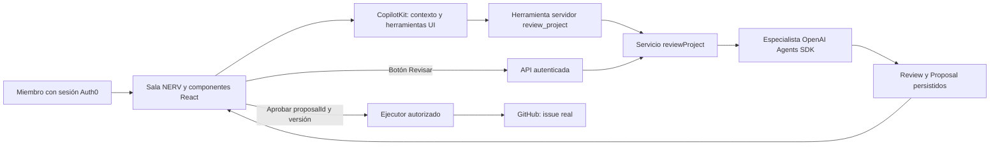

# NERV: recursos del evento e instrucciones de arranque

> **Arranque histórico.** Para la ventana reducida usar [MVP de 110 minutos](../mvp/README.md), que determina herramientas y reparto vigentes. Este inventario conserva enlaces y posibilidades futuras; no activa integraciones fuera de ese MVP.

Este documento concreta cómo usar el paquete de recursos aportado por el equipo para construir **una plataforma interactiva compartida**. Complementa el plan y los tres prompts; no instala servicios ni presupone créditos activados. Documentación consultada el 12 de septiembre de 2026.

## 1. Decisión de implementación

Partir de `apps/web` del [Agents, Everywhere starter kit](https://github.com/CopilotKit/agents-everywhere-starter-kit). Adaptar su interfaz y dominio a NERV, dentro del repositorio existente. P2 fija el commit de referencia y conserva sus versiones compatibles; la estructura real del checkout manda sobre ejemplos de documentación de otra versión.

El template web ya reúne Next.js, CopilotKit, contexto de pantalla y un ejemplo de propuesta/aprobación con persistencia en Ambiguous. Todavía deben construirse la sala multiusuario, Charter, RACI, Kanban y reuniones de NERV. [Guía del template web](https://github.com/CopilotKit/agents-everywhere-starter-kit/blob/main/apps/web/README.md).

**Núcleo elegido:** Starter Kit + CopilotKit + OpenAI Agents SDK + Auth0. Mantener Postgres alojado en Supabase para datos propios de NERV; se usa como almacenamiento, sin un segundo login. Esta pieza complementaria conserva versiones, permisos de proyecto, mensajes y aprobaciones en un único modelo. GitHub sigue siendo la evidencia de ejecución externa elegida por el equipo.

## 2. Instrucción para cada miembro

| Miembro | Herramientas que debe usar | Instrucción y resultado de su frente |
|---|---|---|
| **P1 · Plataforma interactiva** | Template web, React/Next.js, **CopilotKit React**, componentes existentes, Playwright, Claude Code/Codex | Construye sala, Kanban, chat humano y reuniones. Monta el asistente contextual con tarjetas de evidencia/propuesta y herramientas para abrir vistas y seleccionar registros. Una interacción debe guardar o navegar de verdad. Entrega dos sesiones viendo el mismo cambio. [Prompt P1](prompts/P1-PRODUCTO-UI.md) |
| **P2 · Identidad y estrategia** | Starter/lockfile, **Auth0 Next.js SDK**, Postgres/Supabase, Zod, GitHub/CI, Claude Code/Codex | Prepara repositorio y login; implementa acceso, Charter, RACI y datos compartidos. Entrega a P1/P3 un helper de usuario/proyecto y persistencia con control de versión. Custodia migraciones e integración. [Prompt P2](prompts/P2-DOMINIO-INTEGRACION.md) |
| **P3 · Agentes y acciones** | **OpenAI Agents SDK TypeScript**, runtime CopilotKit, GitHub REST, Vitest, Claude Code/Codex; Exa como extensión asignada | Implementa planner/coordinator/risk, contexto autorizado y componentes ReviewCard/ProposalCard. P1 los importa en shell/renderizadores CopilotKit. Entrega una propuesta que un lead aprueba y que crea una issue real. [Prompt P3](prompts/P3-AGENTE-GITHUB.md) |

Cada persona recibe su prompt completo y los contratos. Un agente escritor por conjunto de archivos; si se divide el frente, usar ramas/worktrees separados. Los tres comparten el mismo repositorio remoto, no el mismo checkout en edición.

## 3. Qué se hará con cada recurso del paquete

| Recurso | Uso, responsable y condición |
|---|---|
| **Starter Kit** | Obligatorio como punto de partida. P2 integra la base; P1 adapta `apps/web`; P3 adapta el runtime. No iniciar otro framework en paralelo. |
| **OpenAI / Agents SDK** | Núcleo, P3. Tres definiciones `Agent`, herramientas `tool` y ejecución `run`, con salida validada. Un modelo disponible en la cuenta, fijado en H0. [Quickstart TypeScript](https://openai.github.io/openai-agents-js/guides/quickstart/) |
| **OpenAI / Voice agents** | Fase posterior al hackathon: P1 entrada de voz y P3 sesión/herramientas. Hablar con un agente no implementa reuniones por videollamada. [Guía de voz](https://developers.openai.com/api/docs/guides/voice-agents) |
| **CopilotKit / Quickstart** | Núcleo, P1 interfaz y P3 runtime. Contexto seleccionado, navegación por herramientas y renderizado de resultados en componentes interactivos. [Quickstart](https://docs.copilotkit.ai/quickstart) |
| **CopilotKit / Channels** | Fase posterior: acceso a NERV desde Slack/Teams. P3 conector y P1 experiencia. No se necesita para el chat entre miembros dentro de NERV. [Channels](https://docs.copilotkit.ai/reference/channels) |
| **Auth0 / User authentication** | Núcleo, P2. Universal Login y sesiones reales para tres personas. El ejemplo M2M del kit autentica un servicio; no reemplaza el login humano. [Next.js quickstart](https://auth0.com/docs/quickstart/webapp/nextjs) |
| **Auth0 for AI Agents / skills** | P2 consulta las guías para ayudar a sus agentes programadores. Token Vault y autorizaciones delegadas son una ampliación para APIs por usuario; el MVP usa sesión Auth0 y aprobación NERV. [Recursos de AI Agents](https://auth0.com/ai/docs/intro/overview) |
| **Exa** | Extensión asignada a P3, después de que el núcleo funcione: botón «Investigar contexto» consulta hasta tres fuentes y muestra título, enlace y fecha de consulta. Registrar explícitamente la herramienta en web; no viene conectada automáticamente al chat web del kit. [SDK TS](https://exa.ai/docs/sdks/javascript-sdk), [MCP para agentes de programación](https://exa.ai/docs/reference/exa-mcp) |
| **OpenRouter** | Alternativa de proveedor, P3, decidida en H0 si los créditos/accesos lo justifican. Verificar el cliente CopilotKit y el cliente Agents SDK por separado. No asumir que cambiar una variable del kit redirige ambos. [API quickstart](https://openrouter.ai/docs/quickstart), [catálogo](https://openrouter.ai/models) |
| **Ambiguous AI** | Extensión asignada a P2: consultar un documento de trabajo seleccionado o exportar un resumen aprobado si el esquema MCP real lo permite. Conservar el adaptador del kit como referencia. No duplicar automáticamente todas las tareas entre NERV, Ambiguous y GitHub. [Receta del starter](https://github.com/CopilotKit/agents-everywhere-starter-kit/blob/main/using-sponsor-tools.md) |
| **Mozilla.ai / llamafile** | Fase posterior, P3: experimentar con inferencia local cuando el equipo priorice trabajo privado/offline. No descargar modelos ni cambiar el motor durante el cierre. [llamafile](https://www.mozilla.ai/open-tools/llamafile) |

Las extensiones tienen dueño, pero no bloquean la entrega. Si a T205 el ciclo principal está estable, el equipo elige **como máximo una** entre Exa y Ambiguous para el margen disponible. Voz, Channels e inferencia local esperan a otra fase. No asignar a los tres equipos integraciones opcionales simultáneas.

El paquete enumera recursos, no contiene las claves ni acredita que los créditos estén canjeados. Los enlaces exactos al onboarding privado, al ejemplo de hackathon de Mozilla y a las ofertas se obtienen del portal por una persona; no inventar URLs ni montos. Las páginas Ambiguous de acceso/CLI deben verificarse desde sus instrucciones Connect al disponer del workspace.

## 4. Conexión concreta entre interfaz y especialistas

CopilotKit y Agents SDK se unen mediante **una función de servidor de NERV**, `reviewProject(context, input)`. La herramienta CopilotKit invoca esa función; el endpoint `/api/agent/review` invoca la misma. La función ejecuta el especialista y devuelve JSON validado con IDs de registros persistidos. Es una composición del proyecto, no un adaptador AG-UI oficial asumido. [Herramientas de servidor CopilotKit](https://docs.copilotkit.ai/server-tools).

P3 ensaya la compatibilidad en H0 y completa la prueba integrada antes de T75; si falla, adopta el botón directo. No mezclar hooks v1/v2 ni instalar un adaptador supuesto. CopilotKit no transmite automáticamente eventos internos o handoffs del SDK. Un clic directo evita una llamada al modelo de interfaz si la persona ya seleccionó qué analizar.

**Alternativa operativa:** si la unión conversacional falla, mantener CopilotKit para contexto/navegación y usar los botones de especialistas con `/api/agent/review`; el motor, persistencia y aprobación son los mismos. Registrar qué recorrido se probó. No rehacer el backend para fabricar un puente de protocolos.

## 5. Qué significa «plataforma interactiva» en esta entrega

- **Charter y RACI:** formularios/celdas editables, validación y guardado, responsables seleccionados del equipo; una segunda sesión ve el cambio.
- **Kanban:** mover tarjeta cambia datos reales; abrirla permite editar su detalle y ver evidencia GitHub. Una animación sin persistencia no cumple.
- **Chat humano:** miembros distintos intercambian mensajes del proyecto. Es independiente del chat con CopilotKit y no se sustituye por conversaciones usuario–IA.
- **Reuniones:** crear y modificar hora, agenda y participantes; cada persona ve su zona y puede abrir los acuerdos.
- **Mapa:** seleccionar objetivo/hito/tarea abre detalle; la visualización se recalcula al editar el plan.
- **Indicadores:** seleccionar una alerta muestra tareas/evidencias que la producen. El filtro por responsable o hito actualiza lo visible.
- **Especialistas:** al seleccionar un registro conocen ese contexto; muestran progreso, fuentes y una propuesta estructurada. «Ver propuesta» abre la tarjeta de revisión; «Aprobar» ejecuta la versión guardada y luego actualiza tablero/bitácora.

Las herramientas de interfaz solo navegan o preparan formularios. No convierten una frase del modelo en permiso para guardar o publicar. El estado en CopilotKit es contexto de sesión; Postgres mantiene los datos compartidos y aprobaciones.

## 6. Primeros 20 minutos y entregas entre frentes

| Tiempo | P1 | P2 | P3 |
|---|---|---|---|
| T0–5 | Fijar composición de la sala y recorrido interactivo | Incorporar starter preservando remoto/documentación; entregar commit mínimo para ramas | Elegir modelo y comprobar acceso a OpenAI/GitHub |
| T5–12 | Montar provider/contexto y tarjetas usando fixture | Configurar Auth0, mapeo de miembros y Postgres; preparar helper de acceso | Comprobar un `Agent` con herramienta y salida validada |
| T12–20 | Probar selección de tarea → contexto actualizado | Commit de base/contratos y entregar sesión+acceso a los demás | Acordar `reviewProject`, herramienta CopilotKit y endpoint directo; ensayo mínimo de unión |

Si el acceso a proveedores toma más tiempo, informar el bloqueo y usar dobles tipados mientras la persona configura la cuenta; nunca presentar esos dobles como integración real. P2 preserva scripts del kit (`verify`, desarrollo web y build del workspace) y documenta los alias de verificación NERV en lugar de asumir que el paquete raíz es una app Next independiente.

**H1:** sala compartida y login, contexto CopilotKit y lectura GitHub. **H2:** tres especialistas y componentes de revisión. **H3:** colaboración y acción GitHub aprobada de punta a punta. **H4/H5:** pruebas, demo y envío. El cronograma completo sigue en [PLAN-MAESTRO.md](PLAN-MAESTRO.md).

P1 humano aprueba experiencia y contenido; P2 humano administra cuentas e integra; P3 humano valida diagnósticos, permisos y uso de APIs. Sus agentes escriben y prueban los módulos asignados. Publicación, canje de créditos, credenciales y compromisos del equipo siguen bajo control humano.
